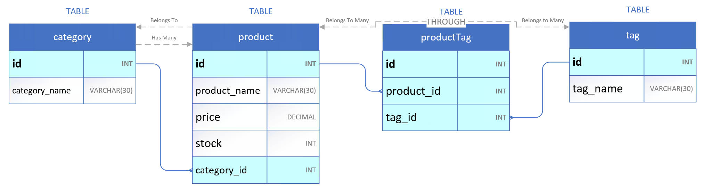
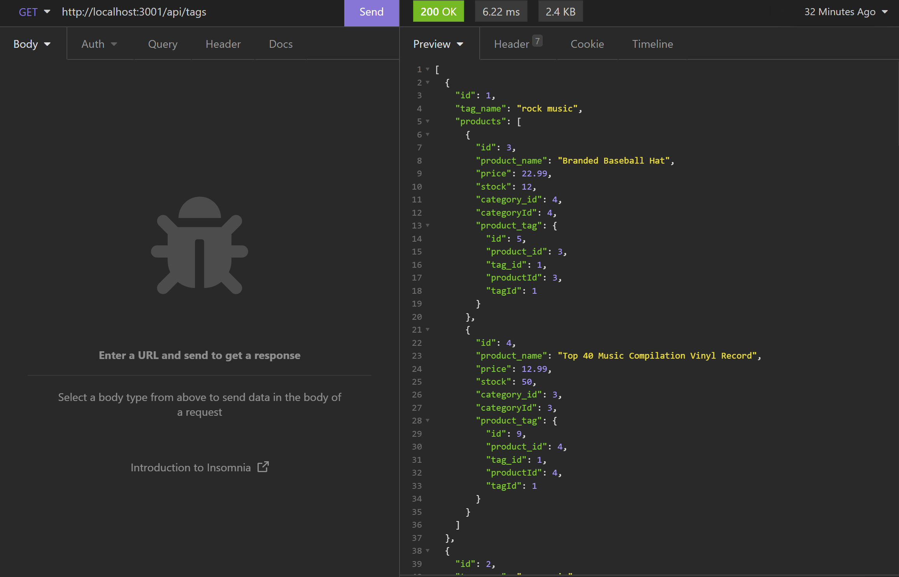

# DU-HW13-E-Commerce

DU Coding Bootcamp Homework 13: E-Commerce Back End

# node.js application with SQL (sequelize) connectivity
This is a node.js script using **express** relying on NPM package **sequelize** to access a SQL server as defined by the connection in the /config/connection.js and environment variables.

Github Repository Address: <https://github.com/GittinIt6/DU-HW13-ORM-E-Commerce>

See walkthrough/demonstration video at <https://youtu.be/BJXoi1F7H88>

## Purpose

This application is specific to anyone that wants to view and populate items within an e-commerce database (product, category, tag).

## Instructions
1. Ensure you have downloaded and installed node.js and have rebooted your system (if Windows)
2. Clone repository to your system.
3. From a terminal, ensure you are in the server.js directory
4. Update the /config/connection.js to include your database connection info as well as your envrionment variables.
5. Within a mysql CLI, run the ./db/schema.sql
6. Run:
~~~
npm i
npm run seed
npm start
~~~

## Audience

The intended audience is an individual that would like to manage a company employee database.

&#x2611; **Technical Knowledge:**
The user of this site does need to have a technical background, and *should* understand node.js and MYSQL capabilities.

## API
| Path                        | Method | Action                   | Requires               |
|-----------------------------|--------|--------------------------|------------------------|
| /api/tags                   | GET    | return all tag data      |                        |
| /api/tags/:id               | GET    | return 1 tag             | :id                    |
| /api/tags                   | POST   | create new tag           | "tag_name":string      |
| /api/tags/:id/:string       | PUT    | update tag               | :id, :name             |
| /api/tags/:id               | DEL    | delete a tag             | :id                    |
| /api/categories             | GET    | return all category data |                        |
| /api/categories/:id         | GET    | return 1 category        | :id                    |
| /api/categories             | POST   | create new category      | "category_name":string |
| /api/categories/:id/:string | PUT    | update category          | :id, :name             |
| /api/categories/:id         | DEL    | delete a product         | :id                    |
| /api/products               | GET    | return all product data  |                        |
| /api/products/:id           | GET    | return 1 product         | :id                    |
| /api/products               | POST   | create new product       | "product_name":string  |
| /api/products/:id/:string   | PUT    | update product           | :id, :name             |
| /api/products/:id           | DEL    | delete a product         | :id                    |

## Technical Detail

This application uses node.js with **sequelize**, **dotenv**, and **express**.

The files are configured as follows:
```
Root Directory/
|
│ --server.js
│ --package.json
│ --.gitignore
│ --readme.md
│ --.env (to be created locally)
|
└───config/ (folder)
|       --connection.js
|
└───db/ (folder)
|    --schema.sql
|
└───models/ (folder)
|       --Category.js
|       --index.js
|       --Product.js
|       --ProductTag.js
|       --Tag.js
└───routes/ (folder)
|   | --index.js
|   └──api (folder)
|       --index.js
|       --product-routes.js
|       --tag-routes.js
|       --category-routes.js
└───seeds (folder)
        --index.js
        --product-seeds.js
        --tag-seeds.js
        --category-seeds.js
        --category-seeds.js
```
>**node.js**: This site uses node.js <https://nodejs.org/>

>**sequelize**: This site uses sequelize <https://sequelize.org/>

>**dotenv**: This site uses dotenv <https://www.npmjs.com/package/dotenv>

>**express**: This site uses express <https://expressjs.com/>

### SQL Schema:



### Screenshot:



## Revision History 

1. This application was created in March 2022 as part of a bootcamp assignment. It was created with starter code provided by the instructor.